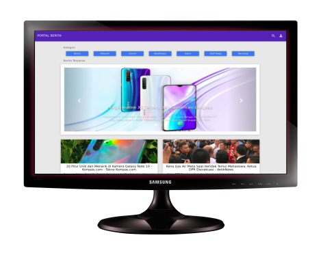

#Aplikasi Portal Berita Berbasis Web!

##Harap aktifkan CURL
Untuk Menggunakan Aplikasi ini harap aktifkan cURL anda untuk tutorial dapat dilihat digoogle ... atau [disini](https://www.petanikode.com/php-curl/) 

##Output
Output akhir dari aplikasi ini adalah sebuah Aplikasi Portal Berita seperti gambar dibawah

##Kebutuhan
Kebutuhan yang harus disiapkan 
- XAMPP
- Text Editor
- Laptop
- Browser
- Koneksi Internet

##Penjelasan Folder
repository ini dibagi ke 4 folder yaitu 0 - 4 yang menggambarkan tiap tahap
- Folder 0, merupakan tahap awal projek
- Folder 1, merupakan tahap menampilkan berita
- Folder 2, merupakan tahap menampilkan berdasar kategori
- Folder 3, merupakan tahap menampilkan berdasar input user

##Penutup
Aplikasi ini dibangun dengan menggunakan
- Template AdminBSB
- API Newsapi.org

